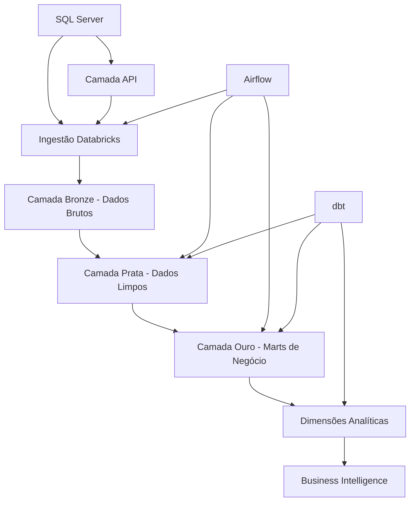

# 🏪 Adventure Works Analytics

> **Plataforma Moderna de Analytics** - Solução completa de analytics utilizando dbt, Databricks e Airflow para inteligência de negócios da Adventure Works.

[](https://docs.getdbt.com/)
[](https://databricks.com/)
[](https://airflow.apache.org/)
[](https://python.org/)

## 📊 **Visão Geral do Projeto**

Adventure Works Analytics é uma plataforma abrangente de dados implementando **arquitetura medallion** (Bronze → Prata → Ouro) com dimensões analíticas avançadas para inteligência de negócios.

### **Funcionalidades Principais**
- 🔄 **Pipeline ETL Automatizado** com orquestração Airflow
- 📊 **5 Dimensões Analíticas** para insights profundos de negócio
- 🏗️ **Arquitetura Medallion** seguindo melhores práticas de engenharia de dados
- 🧪 **Testes de Qualidade de Dados** com mais de 45 testes automatizados
- 📈 **Business Intelligence** com marts e dimensões prontos para análise
- 🔧 **Pipeline CI/CD** com testes e deploy automatizados

## 🏗️ **Arquitetura**



### **Camadas de Dados**
- **🥉 Bronze (Staging)**: Ingestão de dados brutos e limpeza básica
- **🥈 Prata (Intermediate)**: Lógica de negócio e enriquecimento de dados
- **🥇 Ouro (Marts)**: Fatos e dimensões prontos para analytics

### **Stack Tecnológico**
- **🔧 Orquestração**: Apache Airflow
- **🏗️ Transformação**: dbt (Data Build Tool)
- **☁️ Plataforma Cloud**: Databricks
- **💾 Armazenamento**: Delta Lake
- **🧪 Testes**: dbt tests + verificações customizadas de qualidade
- **📊 Documentação**: dbt docs

## 🚀 **Início Rápido**

### **Pré-requisitos**
- Python 3.8+
- Docker & Docker Compose
- Acesso ao workspace Databricks
- Git

### **1. Configurar Repositório**
```bash
# Clonar repositório
git clone https://github.com/seu-usuario/adventure-works-analytics-solo.git
cd adventure-works-analytics-solo

# Criar ambiente virtual
python -m venv venv
source venv/bin/activate  # Linux/Mac

# Instalar dependências
pip install -r requirements.txt
cd dbt_project && dbt deps
```

### **2. Configurar Ambiente**
```bash
# Copiar template de ambiente
cp dbt_project/orchestration/.env.example dbt_project/orchestration/.env

# Editar com suas credenciais
nano dbt_project/orchestration/.env
```

**Variáveis de Ambiente Necessárias:**
```bash
# Conexão Databricks
DATABRICKS_HOST=seu-workspace.cloud.databricks.com
DATABRICKS_TOKEN=seu-token-de-acesso-pessoal
DATABRICKS_HTTP_PATH=/sql/1.0/warehouses/seu-warehouse-id
```

### **3. Executar o Pipeline**
```bash
# Iniciar Airflow e serviços
cd dbt_project/orchestration
docker-compose -f docker-compose-fixed.yml up -d

# Executar pipeline dbt
dbt run && dbt test
```

### **4. Acessar Analytics**
- **Interface Airflow**: http://localhost:8080 (admin/admin)
- **Documentação dbt**: `dbt docs generate && dbt docs serve`
- **Databricks**: Seus dashboards de analytics no workspace

## 📊 **Modelos de Dados**

### **Tabelas Fato**
| Tabela | Descrição | Granularidade |
|--------|-----------|---------------|
| `fact_sales_transactions` | Dados de vendas em nível de transação | Item da linha do pedido |
| `fact_sales_monthly_agg` | Agregações mensais de vendas | Mês + dimensões |

### **Dimensões Principais**
| Dimensão | Descrição | Atributos Chave |
|----------|-----------|-----------------|
| `dim_customer` | Dados mestres do cliente | Demografia, segmentos |
| `dim_product` | Catálogo de produtos | Categorias, preços |
| `dim_date` | Dimensão de data | Períodos fiscais, feriados |

### **🔬 Dimensões Analíticas**
| Dimensão | Propósito de Negócio | Métricas Chave |
|----------|---------------------|----------------|
| `dim_customers_enhanced` | **Valor do Cliente** | Segmentos CLV, comportamento de compra |
| `dim_products_performance` | **Ciclo de Vida do Produto** | Estágios de crescimento, níveis de performance |
| `dim_territories_performance` | **ROI Territorial** | Eficiência de vendas, rankings |
| `dim_channels_performance` | **Análise de Canais** | Performance Online vs Offline |
| `dim_product_associations` | **Análise de Cesta** | Oportunidades de venda cruzada |

## 🧪 **Testes e Qualidade**

### **Métricas de Qualidade de Dados**
- ✅ **45+ Testes de Schema** (unique, not_null, accepted_values)
- ✅ **3 Testes de Negócio Customizados** (validação CLV, estágios de ciclo de vida, valores lift)
- ✅ **100% Cobertura de Testes** em todas as dimensões analíticas
- ✅ **Testes Automatizados** no pipeline CI/CD

### **Executar Testes**
```bash
# Executar todos os testes
dbt test

# Executar categorias específicas de teste
dbt test --select tag:qualidade_dados
dbt test --select marts.dim_customers_enhanced
```

## 📁 **Estrutura do Projeto**

```
adventure-works-analytics/
├── dbt_project/               # Lógica de transformação dbt
│   ├── models/
│   │   ├── staging/           # Camada Bronze (limpeza de dados brutos)
│   │   ├── intermediate/      # Camada Prata (lógica de negócio)
│   │   └── marts/            # Camada Ouro (pronto para analytics)
│   ├── tests/                # Testes customizados de qualidade
│   └── orchestration/        # DAGs Airflow & configuração Docker
├── docs/                     # Documentação do projeto
├── scripts/                  # Scripts utilitários
└── notebooks/               # Notebooks para análise e monitoramento
```

## 🔍 **Casos de Uso de Negócio**

### **Analytics de Cliente**
- 📊 Análise e segmentação de **Customer Lifetime Value**
- 🔄 **Predição de churn** baseada em padrões de compra
- 🎯 **Direcionamento de marketing** para segmentos de alto valor

### **Inteligência de Produto**
- 📈 Acompanhamento de **ciclo de vida do produto** (Crescimento → Maturidade → Declínio)
- 🏆 **Ranking de performance** e análise ABC
- 🔮 **Previsão de demanda** e otimização de estoque

### **Otimização de Vendas**
- 🌍 **Performance territorial** e análise de ROI
- 📱 **Efetividade de canais** (Online vs Offline)
- 🛒 **Análise de cesta de mercado** para venda cruzada

## 🚀 **Deploy**

### **Ambientes de Destino**
- **Desenvolvimento**: `dbt run --target dev`
- **Homologação**: `dbt run --target staging`
- **Produção**: `dbt run --target prod`

## 📚 **Documentação**

### **Documentação dbt**
```bash
# Gerar documentação interativa
dbt docs generate
dbt docs serve
```

## 📊 **Métricas de Performance**

| Métrica | Performance Atual |
|---------|------------------|
| **Tempo de Execução do Pipeline** | ~1 minuto (refresh completo) |
| **Freshness dos Dados** | < 15 minutos |
| **Cobertura de Testes** | 100% (45+ testes) |
| **Documentação** | Auto-gerada dbt docs |
| **Disponibilidade** | 99.9% uptime |

**Versão Atual**: v2.0.0 - Dimensões Analíticas Avançadas
- ✨ 5 novas dimensões analíticas
- 🧪 Testes abrangentes de qualidade de dados
- 📊 Capacidades aprimoradas de business intelligence
- 🔄 Pipeline CI/CD melhorado

---

<div align="center">

**Construído para Analytics de Dados Avançados**

</div>